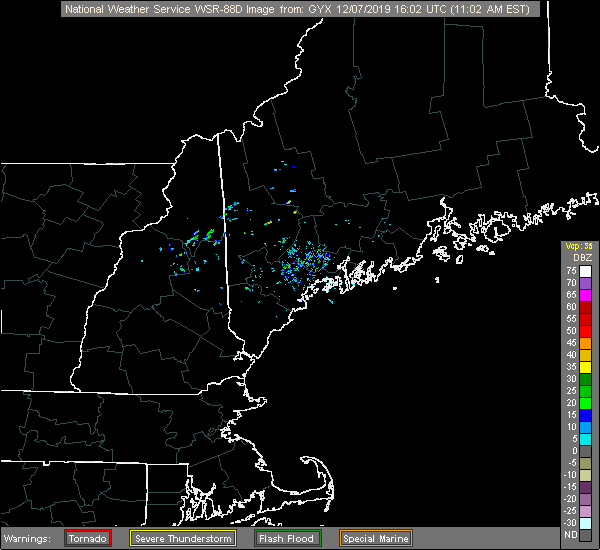
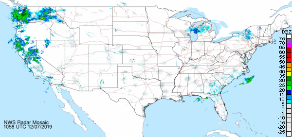
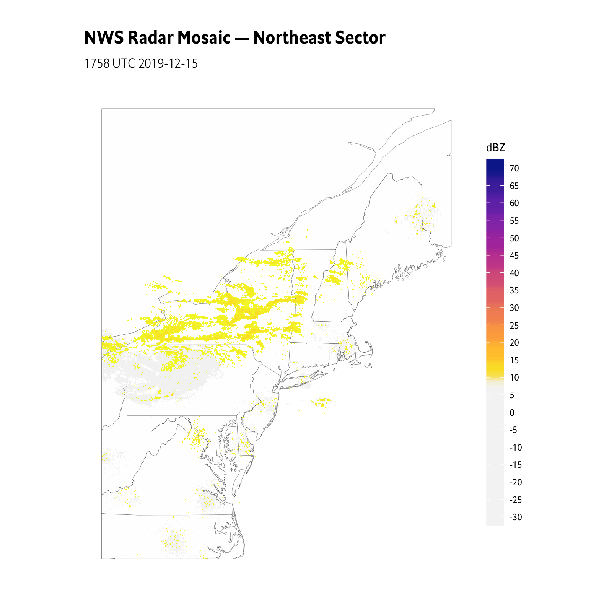

[](https://www.repostatus.org/#active)
[](https://keybase.io/hrbrmstr)

[](https://travis-ci.org/hrbrmstr/rradar)  


# rradar

Animate NOAA NWSRadar Images by Station Id

## Description

NOAA NWS has an array of National Doppler Radar Sites. Tools are
provided to to help you locate stations and create an animated composite
image of recent radar images.

## What’s Inside The Tin

The following functions are implemented:

  - `animate_conus_mosaic`: Create an animated weather radar mosaic for
    the the conterminus U.S.
  - `animate_radar`: Create an animated weather image from a NOAA
    station
  - `latest_radar`: Read latest NWS regional or ConUS radar mosaics as a
    stars object
  - `latest_ridge`: Read latest NWS ridge as a stars object
  - `scale_fill_rradar`: Continuous fill scale for use with NWS raster
    radar data
  - `stations`: NOAA U.S. Radar Stations

## Installation

``` r
install.packages("rradar", repos = "https://cinc.rud.is")
# or
remotes::install_git("https://git.rud.is/hrbrmstr/rradar.git")
# or
remotes::install_git("https://git.sr.ht/~hrbrmstr/rradar")
# or
remotes::install_gitlab("hrbrmstr/rradar")
# or
remotes::install_bitbucket("hrbrmstr/rradar")
# or
remotes::install_github("hrbrmstr/rradar")
```

NOTE: To use the ‘remotes’ install options you will need to have the
[{remotes} package](https://github.com/r-lib/remotes) installed.

## Usage

``` r
library(rradar)

# current version
packageVersion("rradar")
## [1] '0.4.0'
```

### Stations

``` r
library(tidyverse)

filter(stations, state == "Maine")
## # A tibble: 2 x 4
##   state city     dir   station
##   <chr> <chr>    <chr> <chr>  
## 1 Maine Caribou  N0R   CBW    
## 2 Maine Portland N0R   GYX

filter(stations, state == "California")
## # A tibble: 11 x 4
##    state      city             dir   station
##    <chr>      <chr>            <chr> <chr>  
##  1 California Beale AFB        N0R   BBX    
##  2 California Edwards AFB      N0R   EYX    
##  3 California Eureka           N0R   BHX    
##  4 California Hanford          N0R   HNX    
##  5 California Los Angeles      N0R   VTX    
##  6 California Sacramento       N0R   DAX    
##  7 California San Diego        N0R   NKX    
##  8 California San Francisco    N0R   MUX    
##  9 California San Joaquin Vly. N0R   HNX    
## 10 California Santa Ana Mtns   N0R   SOX    
## 11 California Vandenberg AFB   N0R   VBX
```

``` r
animate_radar("GYX")
```

<!-- -->

``` r
animate_radar("VBX")
```

<!-- -->

``` r
animate_conus_mosaic("small")
```

<!-- -->

``` r
library(sf)
library(stars)
library(rradar)
library(viridis)
library(rnaturalearth)
library(hrbrthemes)
library(tidyverse)

wrld <- ne_countries(scale = "medium", country = c("united states of america", "canada"), 
                     continent = "north america", returnclass = "sf")
us <- ne_states("united states of america", returnclass = "sf")

ne_radar <- latest_radar("northeast")

wrld <- st_crop(wrld, st_bbox(ne_radar))
us <- st_crop(us, st_bbox(ne_radar))

ggplot() +
  geom_sf(data = wrld, size = 0.125, fill = '#fefefe') +
  geom_sf(data = us, size = 0.125, fill = '#fefefe') +
  geom_stars(data = ne_radar) +
  coord_sf(datum = NA) +
  scale_fill_rradar() +
  labs(
    x = NULL, y = NULL,
    title = "NWS Radar Mosaic — Northeast Sector",
    subtitle = "1758 UTC 2019-12-15"
  ) +
  theme_ipsum_es(grid="") +
  theme(legend.key.height = unit(5, "lines"))
```



## rradar Metrics

| Lang | \# Files |  (%) | LoC |  (%) | Blank lines |  (%) | \# Lines |  (%) |
| :--- | -------: | ---: | --: | ---: | ----------: | ---: | -------: | ---: |
| R    |       10 | 0.91 | 276 | 0.87 |          51 | 0.65 |      127 | 0.77 |
| Rmd  |        1 | 0.09 |  40 | 0.13 |          27 | 0.35 |       39 | 0.23 |

## Code of Conduct

Please note that this project is released with a Contributor Code of
Conduct. By participating in this project you agree to abide by its
terms.
